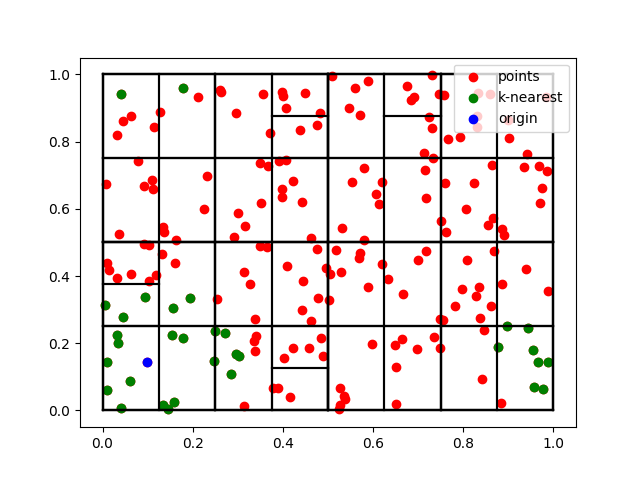
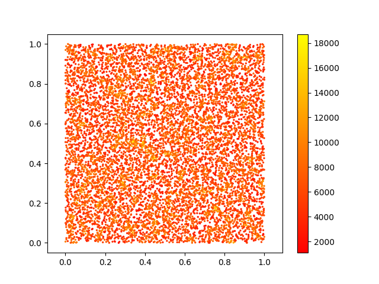

# esc202-fs23

Repo for ESC202 Simulations in Natural Sciences in FS23 at UZH

The goal is to write a SPH (Smoothed Particle Hydrodynamics) simulation

Current progress:

## [treebuild](./week-01-treebuild/treebuild.py)

## [Nearest neigbours](./week-02-NN/main.py)

## [Density Calculation](./week-03-densities/main.py)

### Code got parallelized and now runs on all available cores, example 100'000 particles:

### 10k Particles with 'magma' colourmap:

